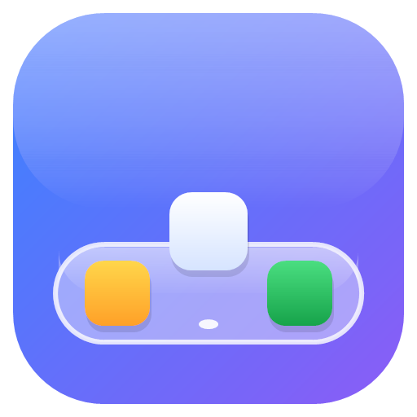

<p align="center"></p>

# GlassDock

A glass replacement for the Windows 11 taskbar. Instead of one bar across the whole screen, you get:

- a small **dock** in the centre with your apps, which resizes itself to its contents;
- a **media player** bubble next to the dock while something is playing;
- a **status bar** in the bottom-right corner with tray icons, network, volume, battery and the clock.

All of them are drawn as glass that refracts what's behind it: the background is magnified and softened towards the middle of each bubble and stays clear at the rim.

## Download

1. Download **`GlassDockSetup.exe`** from the [latest release](https://github.com/RC014/GlassDock/releases/latest) and run it. Windows may show "Windows protected your PC" because the app isn't code-signed: click **More info** › **Run anyway**.
2. Click **Install**. GlassDock is installed for your user account in `%LOCALAPPDATA%\Programs\GlassDock` (no administrator rights needed), with a Start menu shortcut and an entry in **Settings › Apps › Installed apps**. It starts automatically when you sign in.
3. To update, run a newer `GlassDockSetup.exe`; your settings are kept. To uninstall, use **Settings › Apps › Installed apps › GlassDock › Uninstall** (this also brings the Windows taskbar back).

On first run GlassDock imports your current Windows taskbar pins, hides the Windows taskbar and adds itself to startup. All of this can be changed in its settings.

Prefer no installer? Each release also has a standalone `GlassDock.exe` you can run from anywhere. Keep it out of OneDrive (or other synced) folders: at sign-in Windows may try to start GlassDock before OneDrive is ready, and the start fails.

`GlassDockSetup.exe /S` installs or updates silently.

Requires Windows 11 (64-bit).

## Build from source

Needs the [.NET 10 SDK](https://dotnet.microsoft.com/download).

```
git clone https://github.com/RC014/GlassDock.git
cd GlassDock
dotnet build -c Release
bin\Release\net10.0-windows10.0.22621.0\GlassDock.exe
```

To build the release files (`publish\GlassDock.exe`, the standalone app, and `publish\GlassDockSetup.exe`, the installer that carries it):

```
powershell -ExecutionPolicy Bypass -File build-release.ps1
```

The version comes from `<Version>` in `GlassDock.csproj`. The installer project is in `Installer\` and targets .NET Framework 4.8, which is built into Windows.

## Showing and hiding the bars

The bars stay hidden and float over your windows; they never take screen space away from apps.

- Push the cursor against the **bottom edge under the dock** to bring up the dock (and the media player with it).
- Push it against the **bottom edge on the right half of the screen** to bring up the status bar.
- Each bar slides away about a tenth of a second after the cursor leaves it. It stays up while one of its menus, the hidden-icons panel or a window preview is open.
- Switching to another window closes any open menus and hides the bars.
- The bars don't appear over full-screen games and videos.

## Dock

- **Click** an app to open it; click it again to minimise it. If an app has several windows, clicking cycles through them.
- **Middle-click** opens a new window of the app.
- **Hover** over the icons to magnify them in a wave and see the app's name. Hover a running app for a moment to see **live previews** of its windows: click a preview to switch to that window, or its × to close it.
- **Right-click** an app for its window list, New window, Keep in Dock / Remove from Dock, Show in File Explorer, Close and GlassDock settings.
- **Drag** any icon to move it; the other icons slide aside to show where it will land. Drag a running app onto the pinned side (left of the divider) to pin it there. Drag a pinned icon up off the dock and let go to remove it. Drop an `.exe` or `.lnk` file onto the dock to pin it.
- A dot under an icon means the app is running, a wide bar means it's the active window, and an orange dot means the app wants your attention.
- The **Windows button** on the left opens the Start menu (see below); right-click it for the GlassDock menu.

## Start menu

- The **Windows button** on the dock and a **press of the Windows key** open GlassDock's glass Start menu. Windows-key shortcuts (Win+E, Win+R, Win+Shift+S, Win+L…) keep working as usual: only a press of the Windows key on its own opens the menu.
- Start typing to **search** your apps (by name, word or initials, e.g. "vsc"); use the arrow keys and Enter to open one.
- **Pinned** apps at the top (File Explorer, Settings and Microsoft Store to begin with): right-click any app for Pin to Start / Unpin from Start, Move to front, Keep in Dock and Uninstall.
- **Recent** files you opened, with how long ago.
- **All apps** lists everything in Windows' Start list, including Store apps.
- Your account (click it for account settings) and the **power** button: Lock, Sign out, Sleep, Shut down, Restart, and **Windows Start menu** to open Windows' own one.
- It closes when you click elsewhere, press Esc or open something.

## Volume

The volume keys change the volume in 2% steps and show GlassDock's glass volume indicator near the bottom of the screen instead of Windows' pop-up. Scrolling on the status bar shows it too.

## Media player

- Appears next to the dock while any app is playing or paused media (music apps, videos in a browser, and so on) and slides in and out with the dock. If several apps have media, it shows the one that's playing.
- Previous / play-pause / next buttons. Click the cover or title to bring the player app to the front.
- You can choose whether it shows the cover, the title and the artist, and how wide it is.

## Status bar

- `^` shows the hidden tray icons. Icons you set to "always show" in Windows Settings › Taskbar › Other system tray icons appear directly in the bar. Clicking or right-clicking a tray icon opens that app's own menu.
- Network / volume / battery: click to open GlassDock's **Quick Settings** panel, scroll to change the volume, middle-click to mute. The panel (on the same glass as the bars) has the now-playing card, Wi-Fi and Bluetooth (with network/device names; the arrow opens their settings), airplane mode, accessibility, energy saver, live captions, brightness and volume sliders, battery and a shortcut to Windows Settings. Click anywhere outside it to close it.
- Click the clock to open notifications and the calendar.

## GlassDock menu

Right-click the Windows button, the media player, the clock or any empty spot on a bar (or use **GlassDock settings…** at the bottom of an app's right-click menu) for: Task Manager, Taskbar settings, Start with Windows, GlassDock settings…, Reload GlassDock and Quit GlassDock.

Menus close by themselves when you move the cursor away from them.

## Settings

**GlassDock settings…** opens a window with sliders and switches; **Save & apply** reloads GlassDock with the new settings. They are stored in `%AppData%\GlassDock\settings.json`.

| Setting | Default | Meaning |
|---|---|---|
| `IconSize` | 37 | Dock icon size |
| `Magnification` | 1.35 | How much hovered icons grow in the wave (1 = off) |
| `ShowStartButton` | true | Windows button at the left of the dock |
| `ShowMediaPlayer` | true | Media player bubble next to the dock |
| `MediaPlayerWidth` | 200 | Width of the media player (200–600) |
| `ShowMediaArt`, `ShowMediaTitle`, `ShowMediaArtist` | cover only | What the media player shows |
| `CornerRadius` | 19 | Roundness of the bubbles |
| `Refraction` | true | Real glass refraction of the background (see the note on screenshots below) |
| `RefractionStrength` | 0.8 | How strongly the glass bends the background along its rim (0–1) |
| `RefractionEdge` | 1 | Width of the refracting band along the rim (1 = a fifth of the short side; the Start menu uses a narrower band) |
| `RefractionBlur` | 0.35 | Blur seen through the glass (0–1): none at the rim, full over the flat middle |
| `GlassBlur` | 0 | When refraction is off: 1 = frosted glass (Windows blur), 0 = clear glass |
| `GlassOpacity` | 0.43 | Strength of the tint over the glass (lower = clearer) |
| `GlassHighlights` | 0.45 | Strength of the glass's white shine, edge glow and rim (lower = less white) |
| `BottomMargin` / `SideMargin` | 6 | Gap between the bubbles and the screen edges |
| `AutoHide` | true | Show the bars only when the cursor touches the bottom edge |
| `ReserveScreenSpace` | false | With `AutoHide` off: maximised windows stop above the dock |
| `HideWindowsTaskbar` | true | Hide the original Windows taskbar while GlassDock runs |
| `ShowSeconds`, `ShowDate` | false, true | Clock options |
| `GlassStartMenu` | true | The Windows button opens the glass Start menu (off: Windows' Start) |
| `WindowsKeyOpensGlassStart` | true | A press of the Windows key on its own opens the glass Start menu |
| `GlassVolumeIndicator` | true | Volume keys show the glass indicator instead of Windows' pop-up |
| `StartPins` | Explorer, Settings, Store | Apps pinned in the Start menu (`AppID`s from the shell's Applications folder) |
| `Pinned` | your taskbar pins | Pinned apps: `.lnk` / `.exe` paths or `shell:AppsFolder\<AppID>` entries |

**Screenshots:** with refraction on, GlassDock reads the screen behind the bubbles, so the bubbles exclude themselves from screen capture to avoid seeing themselves. That means they don't appear in screenshots or screen recordings. Turn refraction off if you need them to.

## If the Windows taskbar doesn't come back

Quitting GlassDock restores the Windows taskbar. If GlassDock was killed or crashed, run:

```
GlassDock.exe --restore
```

## Uninstalling

- **Installed with GlassDockSetup.exe:** Settings › Apps › Installed apps › GlassDock › Uninstall. This restores the Windows taskbar, removes the shortcuts, the startup entry and the program, and asks whether to delete your settings too.
- **Standalone GlassDock.exe:** untick **Start with Windows** in GlassDock settings, choose **Quit GlassDock** (this brings the Windows taskbar back), then delete the exe and `%AppData%\GlassDock` (settings and pinned shortcuts).

## Development

- The glass shaders in `Shaders\` are precompiled (`.ps`). After editing a `.fx` file, recompile it with `fxc` from the Windows SDK, e.g. `fxc /T ps_2_0 /E main /O3 /Fo Shaders\Lens.ps Shaders\Lens.fx`.
- Since the bars don't show up in screenshots while refraction is on, setting the environment variable `GLASSDOCK_DUMP=<path prefix>` makes GlassDock render each visible bar, Quick Settings, the Start menu and the volume indicator to `<prefix>_<name>_<n>.png` once a second for a few seconds after start-up.

## Notes

- Only the primary monitor is supported.
- Built on [ManagedShell](https://github.com/cairoshell/ManagedShell), the library behind RetroBar and Cairo Desktop, for the window list and tray icons.
- MIT licensed (see `LICENSE`).
